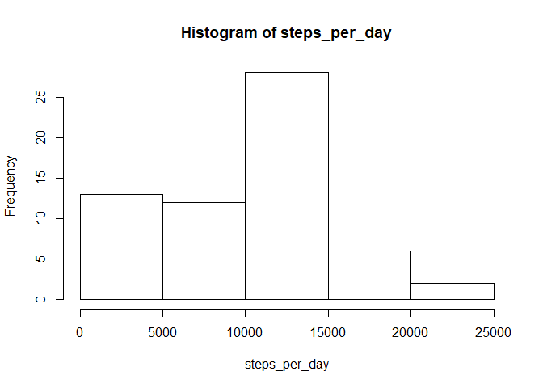
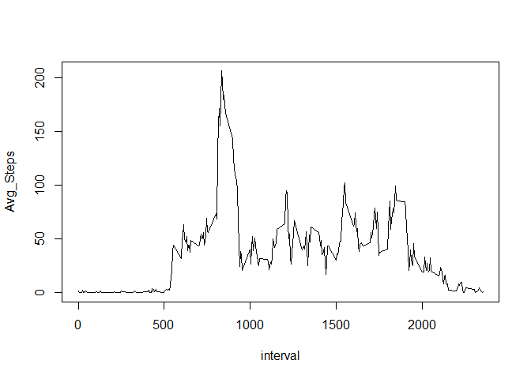
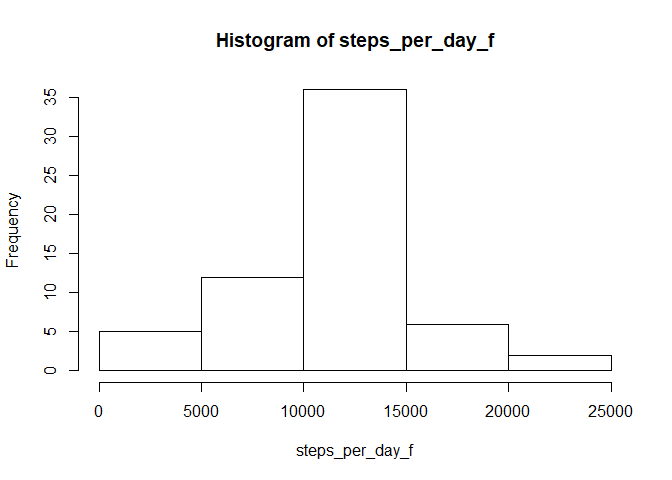
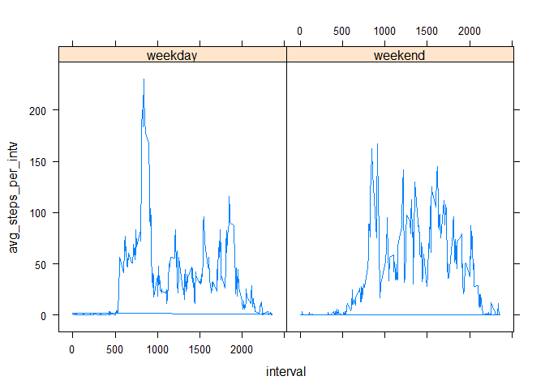

## Loading and preprocessing the data

```r
download.file("https://d396qusza40orc.cloudfront.net/repdata%2Fdata%2Factivity.zip", "activity.zip")
unzip("activity.zip", exdir = "activty_data")
activity <- read.csv("activty_data/activity.csv")
activity$date <- as.Date(as.character(activity$date))
```

## What is mean total number of steps taken per day?

```r
steps_per_day <-tapply(activity$steps,as.factor(activity$date),function(x) sum(x, na.rm = TRUE))
hist(steps_per_day)
```

<!-- -->

```r
mean(steps_per_day)
```

```
## [1] 9354.23
```

```r
median(steps_per_day)
```

```
## [1] 10395
```


## What is the average daily activity pattern?

```r
avg_steps_per_intv <- tapply(activity$steps,as.factor(activity$interval), function(x) mean(x, na.rm = T))
avg_steps_per_intv_df <- data.frame(interval = unique(activity$interval), Avg_Steps = avg_steps_per_intv)
# Histogram
with(avg_steps_per_intv_df, plot(interval, Avg_Steps, type = "l"))
```

<!-- -->

```r
# max
avg_steps_per_intv_df[avg_steps_per_intv_df$Avg_Steps == max(avg_steps_per_intv_df$Avg_Steps),]
```

```
##     interval Avg_Steps
## 835      835  206.1698
```

## Imputing missing values
### Number of missing values

```r
sum(is.na(activity$steps))
```

```
## [1] 2304
```
### Replacing the NAs with Average Steps of that interval

```r
filled_df <- activity
for(i in which(is.na(filled_df$steps))) {
  # The NAs are filled with the average steps of that particuliar time interval
  filler <- avg_steps_per_intv_df[avg_steps_per_intv_df$interval == filled_df$interval[i],"Avg_Steps"]
  filled_df$steps[i] <- filler
}
```
### Histogram of filled dataset

```r
steps_per_day_f <-tapply(filled_df$steps,as.factor(filled_df$date),function(x) sum(x, na.rm = TRUE))
hist(steps_per_day_f)
```

<!-- -->
### Mean and Median of filled dataset

```r
mean(steps_per_day_f)
```

```
## [1] 10766.19
```

```r
median(steps_per_day_f)
```

```
## [1] 10766.19
```
The Mean and Median go slightly up, the Histogram shoes that there are less days with a small sum of steps and more days with a medium amount of days, so the Histogram shifts to the right

## Are there differences in activity patterns between weekdays and weekends?

```r
days <- unique(weekdays(activity$date))
weekday <- days[1:5]
weekend <- days[6:7]

library(dplyr)
```

```
## 
## Attaching package: 'dplyr'
```

```
## The following objects are masked from 'package:stats':
## 
##     filter, lag
```

```
## The following objects are masked from 'package:base':
## 
##     intersect, setdiff, setequal, union
```

```r
#Function to decide if weekday or weekend
weekday_or_end <- function (Date) {
  if(weekdays(Date) %in% weekday) {
    return("weekday")
  } else {
    return("weekend") 
  }
}
filled_df <- filled_df %>% mutate(day = as.factor(sapply(filled_df$date, weekday_or_end)))
#Calculate average steps per interval across weekdays and weekend days
filled_df <- filled_df %>% group_by(day,interval) %>% mutate(avg_steps_per_intv = mean(steps, na.rm=TRUE))

#Plot
library(lattice)
xyplot(avg_steps_per_intv~ interval|day, data = filled_df, type = "l")
```

<!-- -->
